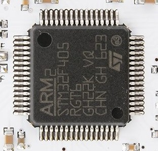
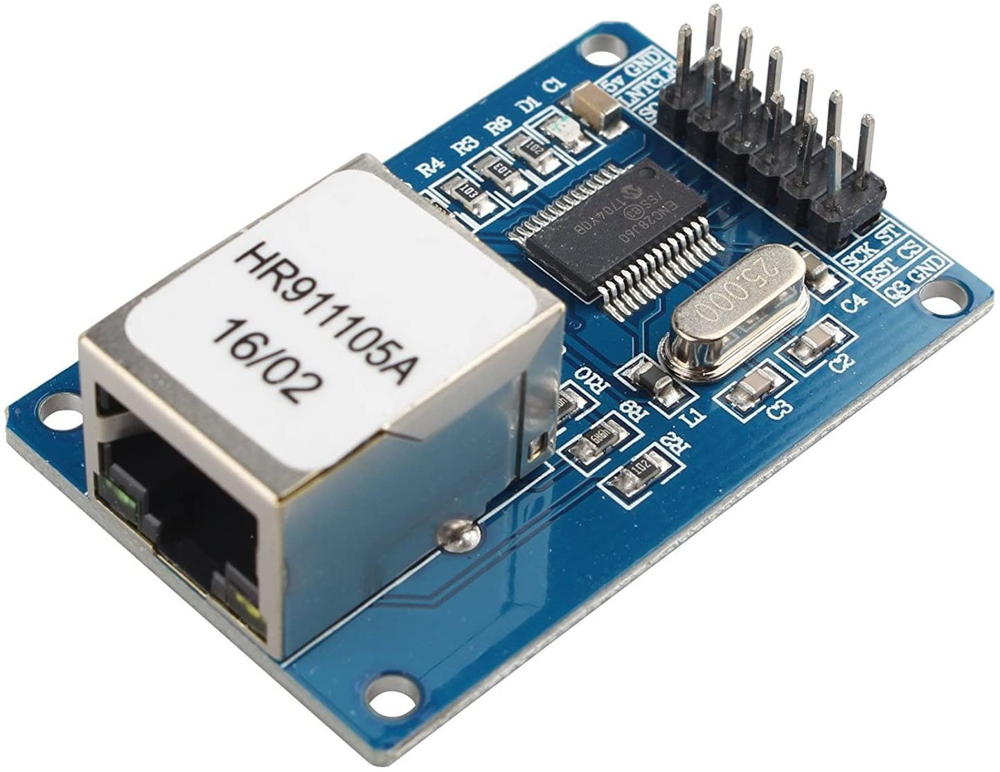
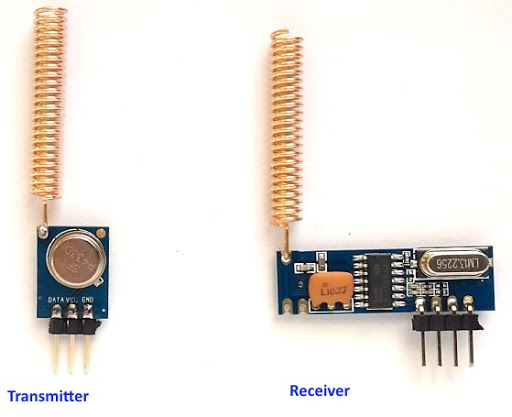
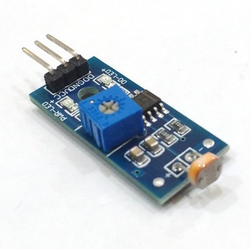
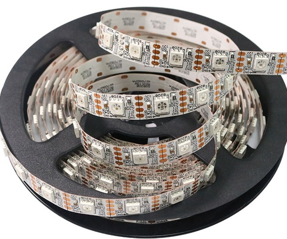
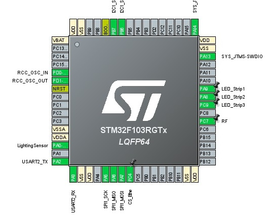

# STM32_LED_RTOS
This is project for controlling LED strip (ws2812) by RF 435 Mhz remote module, while the LED data frame send  by Ethernet ENC28j60 LAN module. 
An analogue lighting sensor installed, so in different daylight situation shows a different mode of LED strip. The remote control can light on , off the LED strip 


,,



  

To accomplish this project STM32F103RG MCU has been selected due to its capabilities and features 
For programming this chip STM32 CubeIDE has been used. CMSIS version 2 as interfere for implementing of FreeRTOS has selected in the software . following image shows the pin configuration of the MCU

 
The main program is comprised of 4 identical tasks as follow. 


```c
void       LED_SHOW_Task(void *argument);
void   RaidoCommand_Task(void *argument);
void       Ethernet_Task(void *argument);
void LightingSensor_Task(void *argument);

```

To synchronize these task, one binary semaphore and one Queue pipe has created. `RaidoCommand` Task use to send user command and has higher priorities. It activated by external interrupt
 `LightingSensor` Task has lower priorities and rest of tasks has normal priorities
To drive the LED WS2812 chip specific timing cycle is needed, therefore during performing this task, a binary semaphore will be held until finishing the LED driving 
. `LED_SHOW_Task()` will light up LED strip if there is data in Queue. 

```cpp
osSemaphoreAcquire( DISPLAY, osWaitForever );
	/* read Queue  and display*/
osSemaphoreRelease( DISPLAY );
```


`RaidoCommand` Task normally suspended unless new interrupt resume it and after decoding the recived command it will suspended again.  The decoded command can suspend or resume the `LED_SHOW` Task
`Ethernet` Task constantly read UDP package and put it in `Queue`. `LightingSensor` Task with lowest priorities updates the light environment through ADC channel. Serial 2 has activated for debugging purpose 

Following is the main code

```cpp

#include "main.h"
#include "cmsis_os.h"

#include "net.h"
#include "enc28j60.h"
#include "ip_arp_udp_tcp.h"
#include "Delay.h"
#include "EtherShield.h"
#include "RF433mhz.h"


//void* osThreadId_t
/* Definitions for LED_SHOW */
      osThreadId_t   LED_SHOWHandle;
const osThreadAttr_t LED_SHOW_attributes = {  .name = "LED_SHOW",  .priority = (osPriority_t) osPriorityNormal,  .stack_size = 128 * 4};
/* Definitions for RaidoCommand */
      osThreadId_t   RaidoCommandHandle;
const osThreadAttr_t RaidoCommand_attributes = {  .name = "RaidoCommand",  .priority = (osPriority_t) osPriorityHigh,  .stack_size = 128 * 4};
/* Definitions for Ethernet */
      osThreadId_t   EthernetHandle;
const osThreadAttr_t Ethernet_attributes = {  .name = "Ethernet",  .priority = (osPriority_t) osPriorityNormal,  .stack_size = 128 * 4};
/* Definitions for LightingSensor */
      osThreadId_t   LightingSensorHandle;
const osThreadAttr_t LightingSensor_attributes = {  .name = "LightingSensor",  .priority = (osPriority_t) osPriorityLow,  .stack_size = 128 * 4};

/* Definitions for UDPqueue */
      osMessageQueueId_t   UDPqueue;
const osMessageQueueAttr_t UDPqueue_attributes = {  .name = "UDPqueue"};
/* Definitions for CommandSema */
      osSemaphoreId_t   CommandSema;
const osSemaphoreAttr_t CommandSema_attributes = {  .name = "CommandSema"};
/* Definitions for DISPLAY */
      osSemaphoreId_t   DISPLAY;
const osSemaphoreAttr_t DISPLAY_attributes = {  .name = "DISPLAY"};
/* USER CODE BEGIN PV */

void SystemClock_Config(void);
static void MX_GPIO_Init(void);
static void MX_ADC1_Init(void);
static void MX_I2C1_Init(void);
static void MX_SPI1_Init(void);
static void MX_USART2_UART_Init(void);

void       LED_SHOW_Task(void *argument);
void   RaidoCommand_Task(void *argument);
void       Ethernet_Task(void *argument);
void LightingSensor_Task(void *argument);

ADC_HandleTypeDef 		hadc1;
I2C_HandleTypeDef 		hi2c1;
SPI_HandleTypeDef 		hspi1;
UART_HandleTypeDef 		huart2;
void rtos_ini(void);

void rtos_ini(void){
	
  osKernelInitialize();
  
  CommandSema               = osSemaphoreNew(1, 1, &CommandSema_attributes);
  UDPqueue                  = osMessageQueueNew (16, sizeof(uint16_t), &UDPqueue_attributes);
  /* creation of LED_SHOW */
  LED_SHOWHandle 			= osThreadNew(LED_SHOW_Task, 		NULL, &LED_SHOW_attributes);
  /* creation of RaidoCommand */
  RaidoCommandHandle 		= osThreadNew(RaidoCommand_Task, 	NULL, &RaidoCommand_attributes);
  /* creation of Ethernet */
  EthernetHandle 			= osThreadNew(Ethernet_Task, 		NULL, &Ethernet_attributes);
  /* creation of LightingSensor */
  LightingSensorHandle 		= osThreadNew(LightingSensor_Task, 	NULL, &LightingSensor_attributes);
}

uint16_t get_udp_port(void)
{
	uint16_t port;

	port  = DATA.buf[UDP_DST_PORT_H_P]<<8;
	port |= DATA.buf[UDP_DST_PORT_L_P];

	return port;
}

int main(void)
{
  HAL_Init();
  SystemClock_Config();
  MX_GPIO_Init();
  MX_ADC1_Init();
  MX_I2C1_Init();
  MX_SPI1_Init();
  MX_USART2_UART_Init();
  
  rtos_ini();

  osKernelStart();

  while(1){}

}


void SystemClock_Config(void)
{
  RCC_OscInitTypeDef 				RCC_OscInitStruct = {0};
  RCC_ClkInitTypeDef 				RCC_ClkInitStruct = {0};
  RCC_PeriphCLKInitTypeDef 			PeriphClkInit = {0};

  /** Initializes the RCC Oscillators according to the specified parameters
  * in the RCC_OscInitTypeDef structure.
  */
  RCC_OscInitStruct.OscillatorType = RCC_OSCILLATORTYPE_HSI;
  RCC_OscInitStruct.HSIState = RCC_HSI_ON;
  RCC_OscInitStruct.HSICalibrationValue = RCC_HSICALIBRATION_DEFAULT;
  RCC_OscInitStruct.PLL.PLLState = RCC_PLL_NONE;
  if (HAL_RCC_OscConfig(&RCC_OscInitStruct) != HAL_OK)  Error_Handler();
 
  RCC_ClkInitStruct.ClockType = RCC_CLOCKTYPE_HCLK|RCC_CLOCKTYPE_SYSCLK
                              |RCC_CLOCKTYPE_PCLK1|RCC_CLOCKTYPE_PCLK2;
  RCC_ClkInitStruct.SYSCLKSource = RCC_SYSCLKSOURCE_HSI;
  RCC_ClkInitStruct.AHBCLKDivider = RCC_SYSCLK_DIV1;
  RCC_ClkInitStruct.APB1CLKDivider = RCC_HCLK_DIV1;
  RCC_ClkInitStruct.APB2CLKDivider = RCC_HCLK_DIV1;

  if (HAL_RCC_ClockConfig(&RCC_ClkInitStruct, FLASH_LATENCY_0) != HAL_OK)  Error_Handler();
 
  PeriphClkInit.PeriphClockSelection = RCC_PERIPHCLK_ADC;
  PeriphClkInit.AdcClockSelection = RCC_ADCPCLK2_DIV2;
  if (HAL_RCCEx_PeriphCLKConfig(&PeriphClkInit) != HAL_OK)   Error_Handler();

}

static void MX_ADC1_Init(void)
{ 
					  hadc1.Instance 					= ADC1;
					  hadc1.Init.ScanConvMode 			= ADC_SCAN_DISABLE;
					  hadc1.Init.ContinuousConvMode 	= DISABLE;
					  hadc1.Init.DiscontinuousConvMode 	= DISABLE;
					  hadc1.Init.ExternalTrigConv 		= ADC_SOFTWARE_START;
					  hadc1.Init.DataAlign 				= ADC_DATAALIGN_RIGHT;
					  hadc1.Init.NbrOfConversion	 	= 1;
  if (HAL_ADC_Init(	 &hadc1) != HAL_OK)   Error_Handler();
  
  ADC_ChannelConfTypeDef 	  		  sConfig 				= {0};
									  sConfig.Channel 		= ADC_CHANNEL_0;
									  sConfig.Rank 			= ADC_REGULAR_RANK_1;
									  sConfig.SamplingTime	= ADC_SAMPLETIME_1CYCLE_5;
									  
  if (HAL_ADC_ConfigChannel(&hadc1,  &sConfig) != HAL_OK)    Error_Handler();
}

static void MX_I2C1_Init(void)
{
  hi2c1.Instance = I2C1;
  hi2c1.Init.ClockSpeed = 100000;
  hi2c1.Init.DutyCycle = I2C_DUTYCYCLE_2;
  hi2c1.Init.OwnAddress1 = 0;
  hi2c1.Init.AddressingMode = I2C_ADDRESSINGMODE_7BIT;
  hi2c1.Init.DualAddressMode = I2C_DUALADDRESS_DISABLE;
  hi2c1.Init.OwnAddress2 = 0;
  hi2c1.Init.GeneralCallMode = I2C_GENERALCALL_DISABLE;
  hi2c1.Init.NoStretchMode = I2C_NOSTRETCH_DISABLE;
  if (HAL_I2C_Init(&hi2c1) != HAL_OK)    Error_Handler();
}

static void MX_SPI1_Init(void)
{
  hspi1.Instance = SPI1;
  hspi1.Init.Mode = SPI_MODE_MASTER;
  hspi1.Init.Direction = SPI_DIRECTION_2LINES;
  hspi1.Init.DataSize = SPI_DATASIZE_8BIT;
  hspi1.Init.CLKPolarity = SPI_POLARITY_LOW;
  hspi1.Init.CLKPhase = SPI_PHASE_1EDGE;
  hspi1.Init.NSS = SPI_NSS_SOFT;
  hspi1.Init.BaudRatePrescaler = SPI_BAUDRATEPRESCALER_2;
  hspi1.Init.FirstBit = SPI_FIRSTBIT_MSB;
  hspi1.Init.TIMode = SPI_TIMODE_DISABLE;
  hspi1.Init.CRCCalculation = SPI_CRCCALCULATION_DISABLE;
  hspi1.Init.CRCPolynomial = 10;
  if (HAL_SPI_Init(&hspi1) != HAL_OK)    Error_Handler();
}

static void MX_USART2_UART_Init(void)
{
  huart2.Instance = USART2;
  huart2.Init.BaudRate = 115200;
  huart2.Init.WordLength = UART_WORDLENGTH_8B;
  huart2.Init.StopBits = UART_STOPBITS_1;
  huart2.Init.Parity = UART_PARITY_NONE;
  huart2.Init.Mode = UART_MODE_TX_RX;
  huart2.Init.HwFlowCtl = UART_HWCONTROL_NONE;
  huart2.Init.OverSampling = UART_OVERSAMPLING_16;
  if (HAL_UART_Init(&huart2) != HAL_OK)   Error_Handler();
}

static void MX_GPIO_Init(void)
{
  
  __HAL_RCC_GPIOD_CLK_ENABLE();
  __HAL_RCC_GPIOA_CLK_ENABLE();
  __HAL_RCC_GPIOC_CLK_ENABLE();
  __HAL_RCC_GPIOB_CLK_ENABLE();

  /*Configure GPIO pin Output Level */
  HAL_GPIO_WritePin(GPIOC, CS_Ethe_Pin|LED_Strip3_Pin, GPIO_PIN_RESET);
  /*Configure GPIO pin Output Level */
  HAL_GPIO_WritePin(GPIOA, LED_Strip2_Pin|LED_Strip1_Pin, GPIO_PIN_RESET);
  /*Configure GPIO pins : CS_Ethe_Pin LED_Strip3_Pin */
  
  GPIO_InitTypeDef 		  GPIO_InitStruct = {0};
  
						  GPIO_InitStruct.Pin = CS_Ethe_Pin|LED_Strip3_Pin;
						  GPIO_InitStruct.Mode = GPIO_MODE_OUTPUT_PP;
						  GPIO_InitStruct.Pull = GPIO_PULLDOWN;
						  GPIO_InitStruct.Speed = GPIO_SPEED_FREQ_LOW;
  HAL_GPIO_Init(GPIOC,   &GPIO_InitStruct);
  /*Configure GPIO pins : LED_Strip2_Pin LED_Strip1_Pin */
						  GPIO_InitStruct.Pin = LED_Strip2_Pin|LED_Strip1_Pin;
						  GPIO_InitStruct.Mode = GPIO_MODE_OUTPUT_PP;
						  GPIO_InitStruct.Pull = GPIO_PULLDOWN;
						  GPIO_InitStruct.Speed = GPIO_SPEED_FREQ_LOW;
  HAL_GPIO_Init(GPIOA,   &GPIO_InitStruct);
   /*Configure GPIO pin : RF_Pin */
						  GPIO_InitStruct.Pin = RF_Pin;
						  GPIO_InitStruct.Mode = GPIO_MODE_IT_RISING;
						  GPIO_InitStruct.Pull = GPIO_NOPULL;
  HAL_GPIO_Init(RF_GPIO_Port,&GPIO_InitStruct);


   /* EXTI interrupt init*/
  HAL_NVIC_SetPriority(EXTI9_5_IRQn, 0, 0);
  HAL_NVIC_EnableIRQ(  EXTI9_5_IRQn);

}


 void EXTI9_5_IRQHandler(void) { HAL_GPIO_EXTI_IRQHandler(RF_Pin);}
 void                            HAL_GPIO_EXTI_IRQHandler(uint16_t GPIO_Pin)
{
  /* EXTI line interrupt detected */
  if (__HAL_GPIO_EXTI_GET_IT(GPIO_Pin) != 0x00u)
  {
	  HAL_NVIC_DisableIRQ(EXTI9_5_IRQn);
    __HAL_GPIO_EXTI_CLEAR_IT(GPIO_Pin); // Clears The Interrupt Flag
      HAL_GPIO_EXTI_Callback(GPIO_Pin);   // Calls The ISR Handler CallBack Function
  }
}
 void HAL_GPIO_EXTI_Callback(uint16_t GPIO_Pin) {
    if(GPIO_Pin == RF_Pin) 
	{
        osThreadResume (RaidoCommandHandle);
    }
}
 

void LED_SHOW_Task(void *argument)
{
  WS2812_Init();
  for(;;)
  {
	osSemaphoreAcquire( DISPLAY, osWaitForever );
	if (osOK == osMessageQueueGet(UDPqueue, DATA.buf, NULL, 0)) 
	{	
	  if (DATA.LightSensor>1024){
	  Write_block(0,0,15,15,RGB[1]     ,WS2812_MODULE_1);
	  WS2812_Write((uint32_t *)DATA.buf,WS2812_MODULE_1);
	  WS2812_Send(                      WS2812_MODULE_1);	}
      else {
	  Write_block(0,0,15,15,RGB[1]     ,WS2812_MODULE_2);
	  WS2812_Write((uint32_t *)DATA.buf,WS2812_MODULE_2);
	  WS2812_Send(                      WS2812_MODULE_2);	
	  }	  
	}
	osSemaphoreRelease( DISPLAY );
    osDelay(1);
  }
  /* USER CODE END 5 */
}

void RaidoCommand_Task(void *argument)
{
  vw_set_rx_pin(RF_Pin);
  
  for(;;)
  {
	    vw_rx_sample = HAL_GPIO_ReadPin(RF_GPIO_Port,RF_Pin);
    if (vw_rx_enabled)	vw_pll();
	vw_get_message(DATA.RFcommand,4);
	
    if((char)DATA.RFcommand[0]=='S')	 osThreadSuspend (LED_SHOWHandle);
	else 								 osThreadResume (LED_SHOWHandle);
	
	osThreadId_t this=osThreadGetId ();
	osThreadSuspend (this); 
  }
   
}

void Ethernet_Task(void *argument)
{
  ES_enc28j60SpiInit(&hspi1);
  ES_enc28j60Init(DATA.mymac);
  if(ES_enc28j60Revision() <= 0) 
  {
	sprintf(str, "Failed to access ENC28J60(delete task)\n",plen);
	HAL_UART_Transmit(&huart2, (uint8_t *)str, sizeof(str), 10);	// 
	return;
  }
  if (allocateIPAddress(DATA.buf, BUFFER_SIZE, DATA.mymac, 80, DATA.myip, DATA.mynetmask, DATA.gwip, DATA.dhcpsvrip, DATA.dnsip) <= 0)
  {
    sprintf(str, "Failed to connet to network (delete task)\n",plen);
	HAL_UART_Transmit(&huart2, (uint8_t *)str, sizeof(str), 10);
  }
  
  uint16_t 	plen;
  char *str;

  /* good to go*/
  for(;;)
  {
	 
	plen = enc28j60PacketReceive(BUFFER_SIZE, DATA.buf);
//  osMessageQueueId_t ,*msg_ptr, msg_prio, timeout	
// If there is UDP packet then  put in Q	
	
	sprintf(str, " %d UDP packet recived\n",plen);
	HAL_UART_Transmit(&huart2, (uint8_t *)str, sizeof(str), 10);

	if ((plen != 0) && eth_type_is_arp_and_my_ip(DATA.buf, plen))	
	{
		if(osOK == osMessageQueuePut(UDPqueue, DATA.buf, NULL, 50)) DATA.R_Pack=true;
       sprintf(str, "Put in Queue\n",plen);
	   HAL_UART_Transmit(&huart2, (uint8_t *)str, sizeof(str), 10);		
		}
	osDelay(1);
  }
  
}

void LightingSensor_Task(void *argument)
{
   HAL_ADC_Start(&hadc1);
   HAL_ADC_PollForConversion(&hadc1, 50);
     
  for(;;)
  {
	  if(HAL_IS_BIT_SET(HAL_ADC_GetState(&hadc1), HAL_ADC_STATE_REG_EOC))
      {
          DATA.LightSensor = HAL_ADC_GetValue(&hadc1)*3.3f/4096;
      }
    osDelay(1000);
  }
  /* USER CODE END LightingSensor_Task */
}

/**
  * @brief  Period elapsed callback in non blocking mode
  * @note   This function is called  when TIM1 interrupt took place, inside
  * HAL_TIM_IRQHandler(). It makes a direct call to HAL_IncTick() to increment
  * a global variable "uwTick" used as application time base.
  * @param  htim : TIM handle
  * @retval None
  */
void HAL_TIM_PeriodElapsedCallback(TIM_HandleTypeDef *htim)
{
  /* USER CODE BEGIN Callback 0 */

  /* USER CODE END Callback 0 */
  if (htim->Instance == TIM1) {
    HAL_IncTick();
  }
  /* USER CODE BEGIN Callback 1 */

  /* USER CODE END Callback 1 */
}

void Error_Handler(void)
{

}

#ifdef  USE_FULL_ASSERT
/**
  * @brief  Reports the name of the source file and the source line number
  *         where the assert_param error has occurred.
  * @param  file: pointer to the source file name
  * @param  line: assert_param error line source number
  * @retval None
  */
void assert_failed(uint8_t *file, uint32_t line)
{

}
#endif /* USE_FULL_ASSERT */


```

